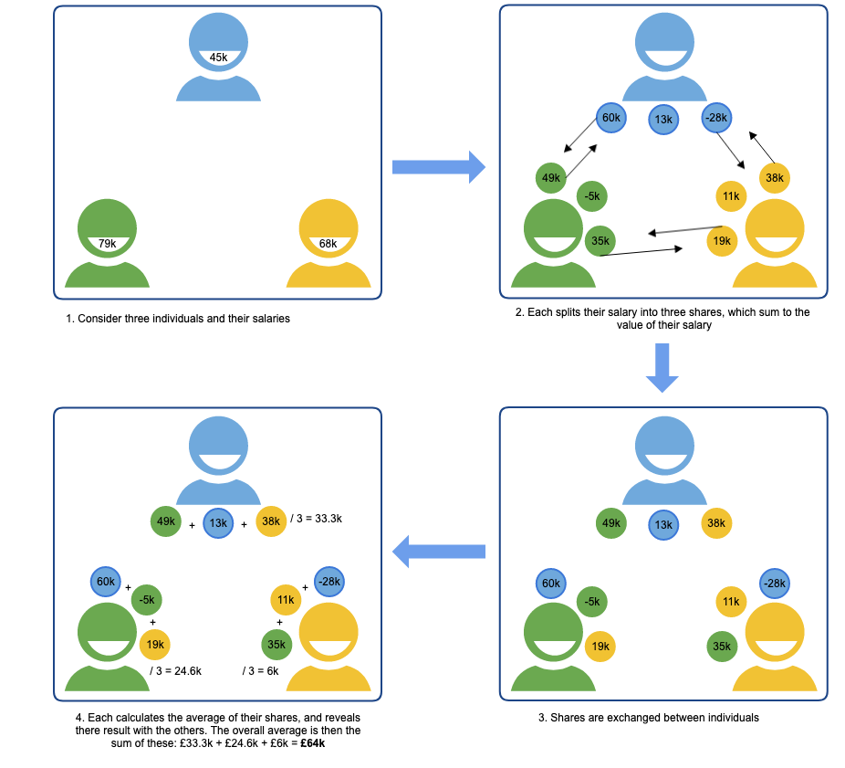
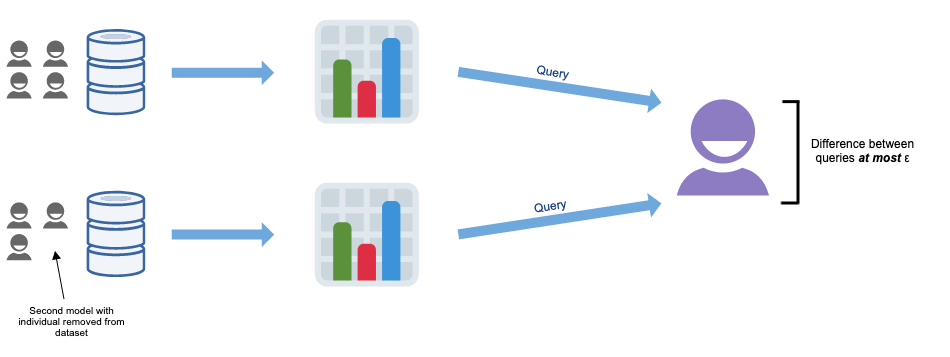

import Collapse from "../components/collapse"
import CookieBanner from "../components/cookies"
import OutboundLink from "../components/outbound-link"

<CookieBanner />

## Homomorphic Encryption (HE)

Homomorphic encryption enables computation directly on encrypted data. Whereas traditional encryption schemes facilitate the encryption of data _in transit_ and _at rest_, homomorphic encryption schemes additionally facilitate encryption _in process_.

<Collapse label="Details">

A data controller homomorphically encrypts their data, sends it to a third party data processor, the processor computes directly on the encrypted data producing an encrypted result, and the result is sent to the controller, who decrypts it. In this way, processing of sensitive data can be outsourced to third parties without having to establish trust, since the data remains encrypted throughout.

Similarly, homomorphic encryption may provide assurance to an organisation conducting their own data processing within a computing environment they do not fully trust, such as when using cloud infrastructure. There are three categories of homomorphic encryption schemas: partially (PHE), somewhat (SHE), and fully (FHE) homomorphic encryption. PHE permits only a single type of operation (e.g. addition) on encrypted data, SHE some more complex operations, and FHE arbitrary operations.

</Collapse>

## Trusted Execution Environments (TEE)

A trusted execution environment (TEE) is a processing environment isolated from a computer’s main processor and memory. Code or dataheld within this environment cannot be accessed from the main processor, and communications between the main processorand the TEE are encrypted.

<Collapse label="Details">

The use cases for TEEs are similar to homomorphic encryption. A data controller can store their data within a TEE, to be operated on by an untrusted third party’s code also held within the TEE. This processing is not on encrypted data, so does not suffer the computational overhead and limitation on operations seen with homomorphic encryption. Once calculated, the result is encrypted before being communicated back to the data controller, who has access to the appropriate decryption key.

</Collapse>

## Multi-party Computation (MPC)

Broadly speaking, a multi-party computation (MPC) protocol enables a function taking input from multiple parties to be jointly computed, whilst each participating party keeps their input secret from the others. This involves data being fragmented over multiple networked nodes, such that each node hosts an “unintelligible shard” of data; inspection of a single shard does not reveal information about the original data. Each node computes a function on its shard, and the outcomes are aggregated into a final result.

<Collapse label="Details">

To gain an intuitive understanding of MPC, consider a group of employees who want to determine their average salary, without revealing their individual salaries to one another. The below figure illustrates how MPC can be implemented using additive secret sharing, relying on basic mathematical properties of addition to split the computation between the parties such that salaries remain confidential. A correct result is obtained by recombining the results of each party’s computations. In practice, MPC protocols are more complex than this naive example, so as to be secure and support a wide range of operations.

</Collapse>

## Federated Analytics (FA)

Federated analytics is a paradigm for executing a computer program against decentralised data, by pushing the code to where the data is situated and executing it there, rather than collecting the data centrally.

<Collapse label="Details">

A subset of federated analytics is _federated learning_, which involves training a machine learning model on distributed datasets. The idea is to train local models directly on user’s devices using local data, and then for the devices to share the weights of the resulting model with one another, in order for a new global model to be determined.

This can be centralized federated learning where a central server is responsible for coordinating the actions of participating devices, or decentralized federated learning where the participating devices coordinate amongst themselves. In either case, the key feature is that user data never leaves the device, as only model weights are communicated.

An attacker could infer user information from these weights, and mechanisms (such as differential privacy, discussed below) are often incorporated to mitigate this.

</Collapse>

## Differential Privacy (DP)

Differential privacy is a formal definition of privacy requiring that the output of any statistical analysis reveals no information specific to an individual in the dataset. An algorithm is made differentially private by adding noise to either the input data (local differential privacy) or to the output it produces (global differential privacy).

<Collapse label="Details">

Differential privacy was developed in response to a 2003 paper by Irit Nisur and Kobbi Nissim which established the fundamental law of information recovery: overly accurate answers to too many queries of a statistical model enables dataset recovery. It follows that in order for a model to be private, it must necessarily be inaccurate to some extent. The amount of noise must be chosen carefully: too little and the dataset will not be private, too much and the output will be so inaccurate as to be useless. This is the _**privacy-utility trade-off**_.

The privacy-utility trade-off is formalised through the concept of Ɛ-differential privacy. Querying a model leaks information about the dataset, and the amount of information leakage increases with the number of queries. The parameter Ɛ quantifies this leakage and is known as the privacy budget. A user is stopped from performing further queries if they exceed their budget. Equivalently, Ɛ can be thought of as the maximum permissible difference between the result of a query performed against a model, and the result of an identical query performed against a model where an individual has been omitted from the dataset.

</Collapse>

## De-identification Techniques (De-ID)

<Collapse label="Details">TODO</Collapse>
