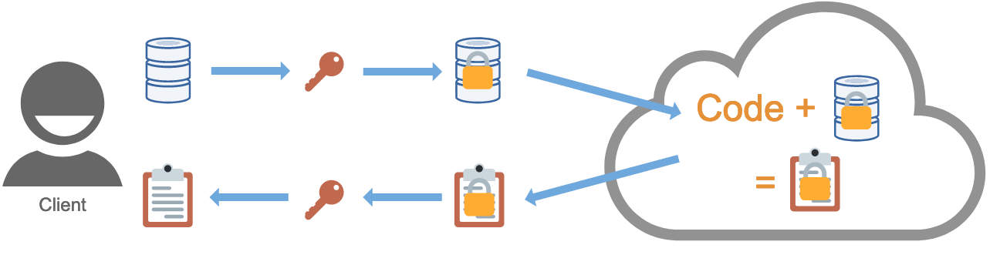
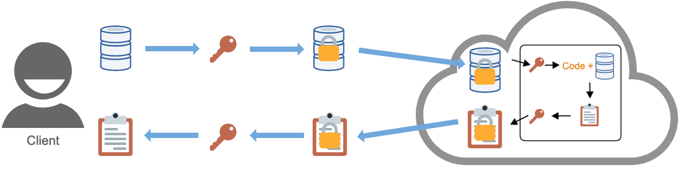

import Collapse from "../components/collapse"
import CookieBanner from "../components/cookies"
import OutboundLink from "../components/outbound-link"

<CookieBanner />

## Homomorphic Encryption

Homomorphic encryption enables computation directly on encrypted data. Whereas traditional encryption schemes facilitate the encryption of data _in transit_ and _at rest_, homomorphic encryption schemes additionally facilitate encryption _in process_.

<Collapse label="Details">

Homomorphic encryption can enable data processing to be outsourced to an untrusted third party. A data controller homomorphically encrypts their data, sends it to a third party data processor, the processor computes directly on the encrypted data producing an encrypted result, and the result is sent to the controller, who decrypts it. In this way, processing of sensitive data can be outsourced to third parties without having to establish trust, since the data remains encrypted throughout.

Similarly, homomorphic encryption may provide assurance to an organisation conducting their own data processing within a computing environment they do not fully trust, such as when using cloud infrastructure.

</Collapse>

## Trusted Execution Environments

A trusted execution environment (TEE) is a processing environment isolated from a computer’s main processor and memory. Code or data held within this environment cannot be accessed from the main processor, and communications between the main processor and the TEE are encrypted.

<Collapse label="Details">

The use cases for TEEs are similar to homomorphic encryption. A data controller can store their data within a TEE, to be operated on by an untrusted third party’s code also held within the TEE. Processing within the TEE occurs directly on unencrypted data - this means processing is likely to be faster than with homomorphic encryption, due to computational overhead incurred by the latter.. Once calculated, the result is encrypted before being communicated back to the data controller, who has access to the appropriate decryption key.

</Collapse>

## Multi-party Computation

A multi-party computation (MPC) protocol enables a function taking input from multiple parties to be jointly computed, whilst each participating party keeps their input secret from the others. This typically involves fragmenting data over multiple networked nodes, such that each node hosts an “unintelligible shard” of data; inspection of a single shard does not reveal information about the original data. Each node computes a function on its shard, and the outcomes are aggregated into a final result.

<Collapse label="Details">

To gain an intuitive understanding of MPC, consider a group of employees who want to determine their average salary, without revealing their individual salaries to one another. The below figure illustrates how MPC can be implemented using additive secret sharing, relying on basic mathematical properties of addition to split the computation between the parties such that salaries remain confidential. A correct result is obtained by recombining the results of each party’s computations. In practice, MPC protocols are more complex than this naive example, so as to be secure and support a wide range of operations.

</Collapse>

## Federated Analytics

Federated analytics is a paradigm for executing a computer program against decentralised data. This involves a party uploading the program to the server or device on which the data is situated, executing it on the server or device with the data in situ, and communicating the results back to the originating party. In this way, no data is directly revealed to the party.

<Collapse label="Details">

A subset of federated analytics is _federated learning_, which involves training a machine learning model on distributed datasets. The idea is to train local models directly on users' devices using local data, and then for the devices to share the weights of the resulting model with one another, in order for a new global model to be determined.

This can be centralized federated learning where a central server is responsible for coordinating the actions of participating devices (as shown below), or decentralized federated learning where the participating devices coordinate amongst themselves. In either case, the key feature is that user data never leaves the device, as only model weights are communicated.

An attacker could infer user information from these weights, and mechanisms (such as differential privacy, discussed below) are often incorporated to mitigate this.

</Collapse>

## Differential Privacy

Differential privacy is a formal definition of privacy requiring that the output of any statistical analysis reveals no information specific to an individual in the dataset. An algorithm isi typically made differentially private by adding noise to either the input data (local differential privacy) or to the output it produces (global differential privacy).

<Collapse label="Details">

Differential privacy was developed in response to a 2003 paper by Irit Nisur and Kobbi Nissim which established the fundamental law of information recovery: overly accurate answers to too many queries of a statistical model enables dataset recovery. It follows that in order for the data used to build a model to be private, it the model must necessarily be inaccurate to some extent. The amount of noise must be chosen carefully: too little and the dataset will not be private, too much and the output will be so inaccurate as to be useless. This is the _**privacy-utility trade-off**_.

The privacy-utility trade-off is formalised through the concept of Ɛ-differential privacy. Querying a model leaks information about the dataset, and the amount of information leakage increases with the number of queries. The parameter Ɛ quantifies this leakage and is known as the privacy budget. A user is stopped from performing further queries if they exceed their budget. Equivalently, Ɛ can be thought of as the maximum permissible difference between the result of a query performed against a model, and the result of an identical query performed against a model where an individual has been omitted from the dataset.

</Collapse>

## De-identification Techniques

We define a de-identification technique as any data transformation or modification that reduces the amount of information about an individual or entity in a dataset, and/or reduces the risk that an individual or entity can be re-identified. These methods are distinguished from the PETs described above in that they involve direct manipulation of the raw data, rather than being mechanisms for protecting confidentiality whilst maintaining maximum utility over the underlying data.

<Collapse label="Details">

Some examples of de-identification techniques are:

- _**Redaction:**_ deleting an entire record or field, or obfuscating part of a record or field (e.g. deleting all but the last 4 digits of a credit card number)
- _**Tokenization:**_ replacing a real value with a randomly generated value
- _**Hashing:**_ applying a function to a value to produce a fixed-length value (or hash)
- _**Generalization:**_ transforming a value to a less precise or bucketed value, e.g. replacing a height of 179cm with a range 170-180cm
- _**k-anonymity:**_ applying a combination of de-identification techniques so that any record in the dataset becomes indistinguishable from (k-1) records

</Collapse>
